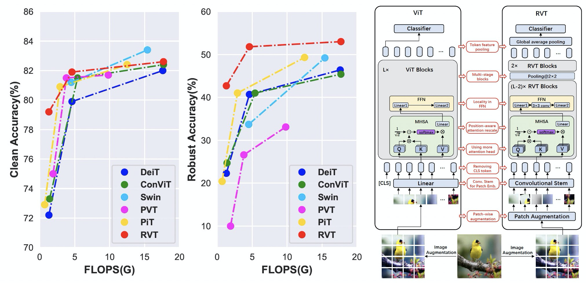

# RVT: Rethinking the Design Principles of Robust Vision Transformer

***Note: Since the model is trained on our private platform, this transferred code has not been tested and may have some bugs. If you meet any problems, feel free to open an issue!***

This repository contains PyTorch code for Robust Vision Transformers.



For details see [Rethinking the Design Principles of Robust Vision Transformer](https://arxiv.org/abs/2105.07926) by Xiaofeng Mao, Gege Qi, Yuefeng Chen, Xiaodan Li, Shaokai Ye, Yuan He and Hui Xue. 

# Usage

First, clone the repository locally:
```
git clone https://github.com/vtddggg/Robust-Vision-Transformer.git
```
Then, install PyTorch 1.7.0+ and torchvision 0.8.1+ and [pytorch-image-models 0.3.2](https://github.com/rwightman/pytorch-image-models):

```
conda install -c pytorch pytorch torchvision
pip install timm==0.3.2
```

We use 4 nodes with 8 gpus to train `RVT-Ti`, `RVT-S` and `RVT-B`:
## Training
### RVT-Ti:
```
python -m torch.distributed.launch --nproc_per_node=8 --nnodes=4 main.py --model rvt_tiny --data-path /path/to/imagenet --output_dir output --dist-eval
```
### RVT-S:
```
python -m torch.distributed.launch --nproc_per_node=8 --nnodes=4 main.py --model rvt_small --data-path /path/to/imagenet --output_dir output --dist-eval
```
### RVT-B:
```
python -m torch.distributed.launch --nproc_per_node=8 --nnodes=4 main.py --model rvt_base --data-path /path/to/imagenet --output_dir output --batch-size 32 --dist-eval
```
If you want to train `RVT-Ti*`, `RVT-S*` or `RVT-B*`, simply add `--use_mask` and `--use_patch_aug` to enable positon-aware attention scaling and patch-wise augmentation. Then modify `--masked_block` to specify which blocks to add positon-aware attention scaling.

## Testing
### RVT-Ti:
```
python main.py --eval --resume rvt_ti.pth --model rvt_tiny --data-path /disk1/imagenet/ILSVRC/Data/CLS-LOC
```
### RVT-Ti*:
```
python main.py --eval --resume rvt_ti*.pth --model rvt_tiny --data-path /disk1/imagenet/ILSVRC/Data/CLS-LOC --use_mask --masked_block 10
```
### RVT-S:
```
python main.py --eval --resume rvt_small.pth --model rvt_small --data-path /disk1/imagenet/ILSVRC/Data/CLS-LOC --use_mask --masked_block 10
```

### RVT-S*:
```
python main.py --eval --resume rvt_small*.pth --model rvt_small --data-path /disk1/imagenet/ILSVRC/Data/CLS-LOC --use_mask --masked_block 5
```

# Pretrained weights

| Model name   |  FLOPs  | accuracy  | weights |
|:-------:|:--------:|:--------:|:--------:|
| `rvt_tiny` |  1.3 G | 78.4 | [link](https://drive.google.com/file/d/1L500fTe3MRNSfrd3bjfbMDk0M11D-bZR/view?usp=sharing) |
| `rvt_small` |  4.7 G | 81.7 | [link](https://drive.google.com/file/d/1YW19LnWNZnx5tn0x-z-4Oypb4ZGD4QYr/view?usp=sharing) |
| `rvt_base` |  17.7 G | 82.5 | Work in Progress |
| | | | |
| `rvt_tiny*` | 1.3 G | 79.3 | [link](https://drive.google.com/file/d/1zKq6_WT2Y4eHHSARmdU-CkA3rttysPd7/view?usp=sharing) |
| `rvt_small*` | 4.7 G | 81.8 | [link](https://drive.google.com/file/d/1g40huqDVthjS2H5sQV3ppcfcWEzn9ekv/view?usp=sharing) |
| `rvt_base*` | 17.7 G | 82.6 | Work in Progress |

Since this work is still working in progress, only the intermediate results of `rvt_base` model (in paper) are reported. We need more time for tuning the `rvt_base` model.
